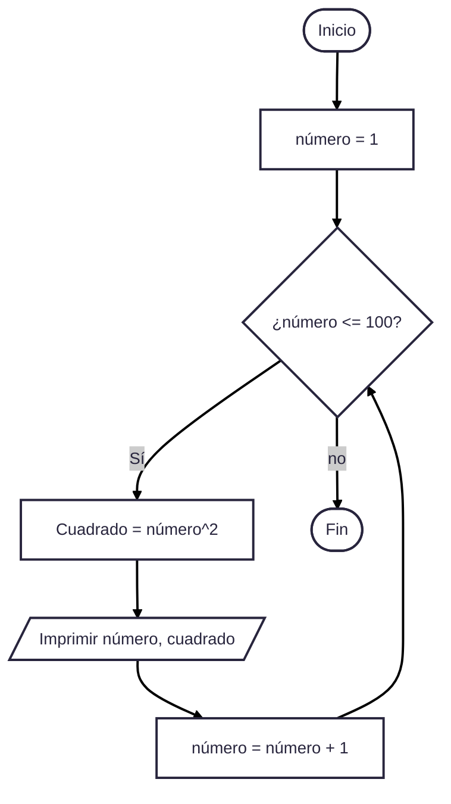
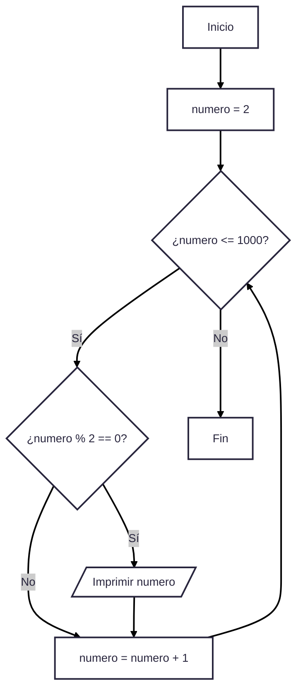
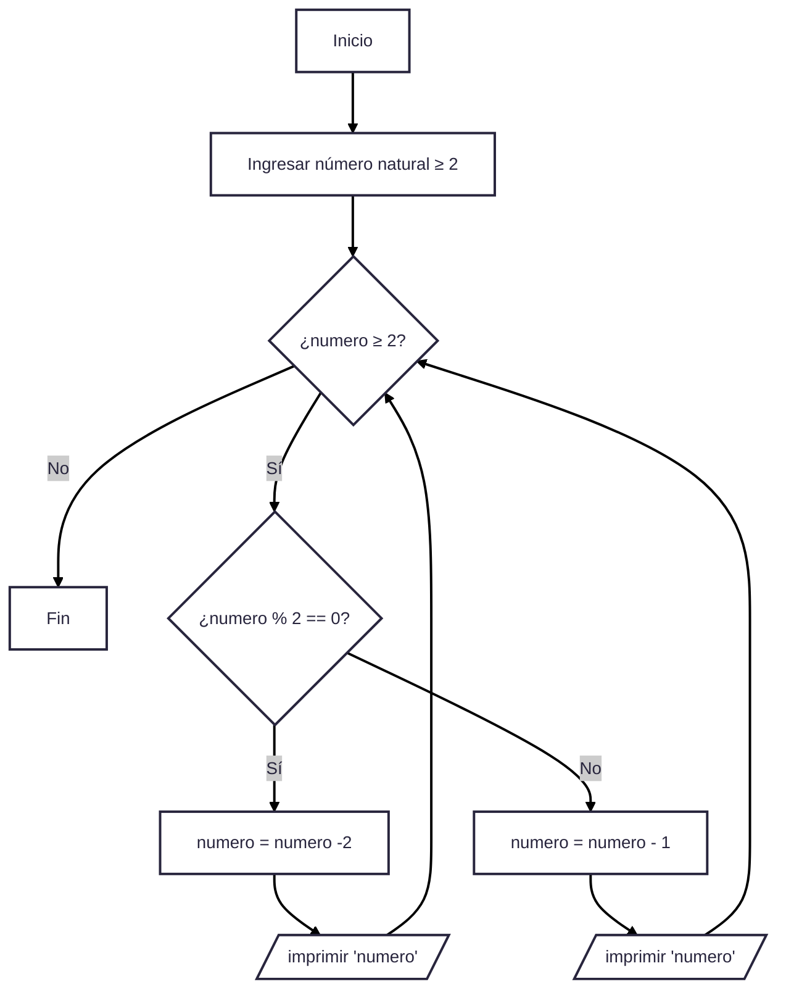

# Reto número 6
### Nombre: Brayan Santiago Rincón Rodríguez
### Curso: Programación de computadores

En este repositorio se le dará solución a lo planteado en el reto n° 6 del curso.

1. Imprimir un listado con los números del 1 al 100 cada uno con su respectivo cuadrado.

### Código en Python:

```python
# Programa para crear un listado con los números del 1 al 100 cada uno con su respectivo cuadrado

numero : int = 1 # Se inicializa la variable numero
while numero <= 100: # Se asigna un ciclo for, el cual evalua la condicion de que número debe ser menor o igual a 100 antes de entrar
    cuadrado : int = numero**2 # Se declara e inicializa la variable cuadrado, la cual nos mostrará el cuadrado del número
    print (numero, cuadrado, sep = " , ") # se imprime el número, seguidamente del cuadrado del mismo
    numero = numero + 1 # se hace una asignación para que la variable numero tengo como valor al siguiente entero y se evalue ese nuevo valor, volviendo a entrar al ciclo while
```

### Diagrama de flujo:



2. Imprimir un listado con los números impares desde 1 hasta 999 y seguidamente otro listado con los números pares desde 2 hasta 1000.

### Código en python:

``` python
# 1. Programa para Imprimir un listado con los números impares desde 1 hasta 999
numero : int = 1 # Se inicializa y declara la variable numero con el valor de 1
while numero <= 999: # se propone un bucle, en donde entrará la variable numero si es menor o igual a 999
    if numero % 2 != 0: # Ahora, con el condicional, el programa evaluará si el número es impar gracias al módulo, el cual tendrá un valor diferente de 0 si el número es impar
        print (numero) # si la variable entró al condicional y la cumplió, ese número es impar y el programa lo imprimirá
    numero = numero + 1 # se hace una asignación para que el bucle evalue inmediatamente el siguiente número

# 2. Programa para imprimir un listado con los números pares desde 2 hasta 1000

numero : int = 2 # Se inicializa y declara la variable numero con el valor de 2
while numero <= 1000:  # se propone un bucle, en donde entrará la variable numero si es menor o igual a 1000
    if numero % 2 == 0: # Ahora, con el condicional, el programa evaluará si el número es par gracias al módulo, el cual tendrá un valor igual a 0 si el número es par
        print (numero) # # si la variable entró al condicional y la cumplió, ese número es par y el programa lo imprimirá
    numero = numero + 1 # se hace una asignación para que el bucle evalue inmediatamente el siguiente número
```

### Diagrama de flujo de los números impares:


### Diagrama de flujo de los números pares:



3. Imprimir los números pares en forma descendente hasta 2 que son menores o iguales a un número natural n ≥ 2 dado

### Código en python:
``` python
# Programa para imprimir los números pares en forma descendente hasta 2 que son menores o iguales a un número natural n ≥ 2 dado

numero = int(input("Ingrese un número natural mayor a 2 para ver los números pares de forma descendente hasta 2: "))
# Se le indica al usuario que debe ingresar un número el cual será evaluado en el programa

while numero >= 2: # Se propone un bucle, el cual entrará con el número ingresado en la consola, si este es mayor a 2
    if numero % 2 == 0: # Se propone un condicional en donde se cumplirá si el residuo de la división del número ingresado entre 2 es 0 (el número es par)
        numero = numero - 2 # ahora el programa asignará un valor de forma descendente a la variable numero.
        print (numero) # Con la asignación anterior se imprime el número par anterior a a la variable, número y el programa volverá a evaluar las condiciones

    else: # si la condición no se cumple (el número es impar), se entrará al ese
        numero = numero - 1 # Se le hace una asignación al número restándole una unidad, haciéndo de esta manera la variable numero un número par
        print (numero) # como la asignación nos dio un número par, este se imprime y volverá al ciclo while
```

### Diagrama de flujo:



4. Imprimir el factorial de un número natural n dado.

```python
# Programa para imprimir el factorial de un número natural dado

contador : int = 1 #se inciialiaza un contador con el valor de 1
factorial : int = 1 # se inciialiaza la variable llamada factorial con el valor de 1
numero = int(input("Ingrese un número natural, el programa le dará el factorial de su número: "))
# se le indica al usuario que digite un valor
while contador <= numero: # se propone un bucle while, el cual entrará al programa si el contador es menor o igual al número ingresado
    factorial = factorial * contador # Se usa la variable factorial, el cual nos ayudará a llevar la cuenta de la multiplicación de todos los números anteriores al digitado por el usuario
    contador = contador + 1 # Se actualiza el contador para que el while evalué el siguiente número

print("El factorial del número "+str(numero)+ " es "+str(factorial)) # Finalmente, se imprimen los resultados
```

5. Implementar un programa que ingrese un número de 2 a 50 y muestre sus divisores.

```python
# Programa para encontrar los divisores de un número entre 2 a 50

contador : int = 1 # Se inicializa la variable contador con el valor de 1
numero = int(input("Ingrese un número de 2 a 50 y a continuación verá sus divisores: "))
# Se le indica al usuario que ingrese una número entero
while contador <= 50: # se propone un bucle while en donde entrará si el contador es menor o igual a 50
    if numero % contador == 0: # Ahora, se hace un condicional si la división entre el número y el contador es exacta, es decir si el contador es divisor del número
        print(contador) # se imprimirá el contador si es divisor
    contador = contador + 1 # Se le hace una asignación a la variable contador para que el ciclo while vuelva a evaluar el siguiente número
```

6. Implementar el algoritmo que muestre los números primos del 1 al 100. Nota: use funciones.

```python
# Programa para determinar los números primos del 1 al 100

def es_primo(n):  # Función que verifica si n es un número primo
    if n < 2:  # Si n es menor que 2, no es primo
        return False  # Retorna False en ese caso
    i : int = 2  # Inicia el divisor en 2
    while i * i <= n:  # Mientras i no supere la raíz cuadrada de n
        if n % i == 0:  # Si n es divisible por i
            return False  # n no es primo, retorna False
        i = i + 1  # Incrementa i para probar el siguiente divisor
    return True  # Si no encontró divisores, n es primo, retorna True

if __name__ == "__main__":  # Punto de entrada principal del programa
    num = 1  # Inicializa la variable num en 1
    print("Números primos del 1 al 100:")  # Imprime el encabezado

    while num <= 100:  # Se pronone un bucle while que recorre los números del 1 al 100
        if es_primo(num):  # Si num es primo
            print(num)  # Imprime num
        num = num + 1  # Incrementa num en 1 con una asignación
```
### Nombre:
Brayan Santiago Rincón Rodríguez

### Curso:
Programación de computadores